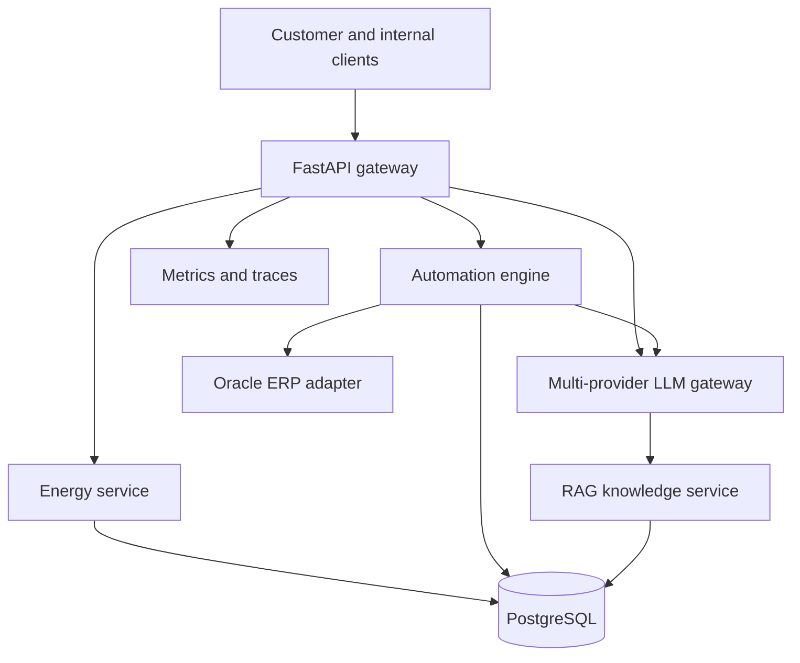

# Climate AI Operations Platform

Production-style backend and internal AI platform for a ClimateTech home-energy company. The system automates energy and finance workflows, connects enterprise services, and gives engineering teams a shared gateway for LLM, RAG, evaluation, and observability.

## Why this project

This project demonstrates the intersection of three modern engineering roles:

- **ClimateTech backend engineering:** customer energy services and third-party integrations
- **Enterprise AI automation:** invoice processing, Oracle-style ERP adapters, approvals, and audit trails
- **LLM platform engineering:** provider routing, retrieval, evaluation, tracing, cost and latency controls

All external providers run in safe local mock mode by default. Adapters can later connect to OCI Generative AI, Oracle ERP/OIC, OpenAI, Anthropic, n8n, or real energy APIs.

## Architecture



## Capabilities

- FastAPI services with health, energy, workflow, LLM, RAG, and evaluation APIs
- Home-energy recommendations based on consumption and tariff data
- Idempotent invoice automation with risk scoring, approvals, and ERP integration
- Provider-agnostic LLM gateway with fallback, budgets, latency and token tracking
- Local semantic retrieval with a swappable pgvector/Qdrant boundary
- RAG grounded-answer endpoint with retrieved-source citations
- Automated groundedness, relevance, latency, and cost evaluation
- Prometheus metrics, structured logs, request IDs and OpenTelemetry-ready hooks
- PostgreSQL persistence, Redis-ready caching, Docker Compose
- Kubernetes deployment, service, HPA and configuration
- Terraform starter module for cloud infrastructure
- CI, linting, typing, unit tests and API integration tests

## Quick start

```bash
cp .env.example .env
docker compose up --build
```

Open:

- API documentation: http://localhost:8000/docs
- Health: http://localhost:8000/health
- Metrics: http://localhost:8000/metrics

Local Python setup:

```bash
python -m venv .venv
source .venv/bin/activate
pip install -r requirements.txt
uvicorn app.main:app --reload
pytest -q
```

## Demo requests

```bash
curl -X POST http://localhost:8000/v1/energy/recommendations \
  -H 'Content-Type: application/json' \
  -d '{"household_id":"HH-101","monthly_kwh":[420,390,355,310,280,250,245,260,300,350,390,440],"solar_capacity_kw":4.2,"tariff_eur_kwh":0.32}'

curl -X POST http://localhost:8000/v1/workflows/invoices \
  -H 'Content-Type: application/json' \
  -d '{"invoice_id":"INV-1001","supplier":"HeatPump GmbH","amount_eur":2450,"purchase_order":"PO-42","description":"Heat pump installation"}'

curl -X POST http://localhost:8000/v1/rag/ask \
  -H 'Content-Type: application/json' \
  -d '{"question":"When should a high-value invoice require manual approval?"}'
```

## Design decisions

| Concern | Approach |
|---|---|
| Provider lock-in | Typed provider interface and routing policy |
| Hallucinations | Context-only prompt, citations, groundedness evaluation |
| Duplicate finance actions | Idempotency keys and workflow state |
| Reliability | Timeouts, fallback provider, health checks and HPA |
| Security | No secrets in source, PII-safe logging, adapter boundaries |
| Cost | Per-request estimates, token budgets and routing |
| Auditability | Request IDs, workflow events and evaluation records |

## Interview explanation

“I designed a ClimateTech AI operations platform rather than a standalone chatbot. It includes typed REST APIs for home-energy services, an idempotent invoice workflow connected through an Oracle ERP adapter, and a reusable LLM gateway with RAG, fallback routing, cost tracking and evaluation. I added Docker, Kubernetes, Terraform, CI and observability so the project demonstrates how AI features become reliable production services.”

## Roadmap

- Replace the in-memory repository with PostgreSQL/SQLAlchemy migrations
- Add OCI Generative AI and OIC implementations behind existing interfaces
- Add pgvector hybrid search and reranking
- Connect n8n via signed webhooks
- Add OAuth2/OIDC and role-based workflow approvals
- Export traces to Grafana Tempo and metrics to Prometheus/Grafana
- Deploy with Argo CD and policy checks

